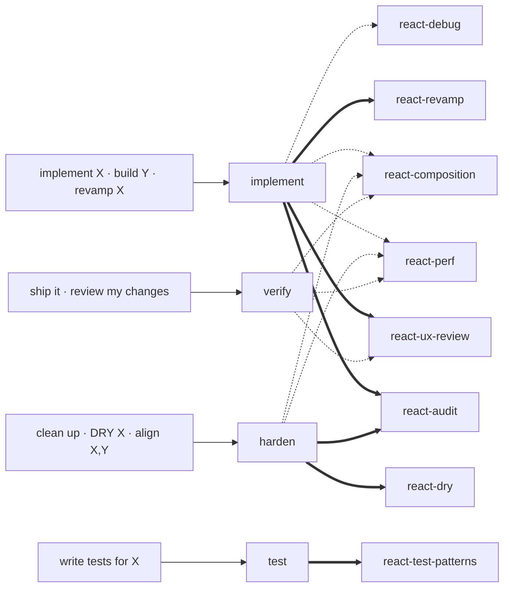

# agent-profiles

Templates + interactive generator for the implement / harden / verify / test agent quartet used by [claude-kit](../../README.md). Pairs with [`react-core`](../react-core/) (the skills the agents invoke).

**Scope: frontend, JS/TS.** Deliberate — the generator locates a project by its `package.json`, and the four roles are shaped around frontend work. Backend repos use [`dev-core`](../dev-core/), which is genuinely stack-agnostic and needs no profile. See D16 in the root [`CLAUDE.md`](../../CLAUDE.md).

**Within that scope, React 19 / Vite is all that works today**, and that part *is* a defect rather than a boundary: the templates name `react-core` skills directly instead of through aliases, so a profile generated for an Angular or Vue repo would order its agents to invoke skills that repo does not have. Making those references resolve against whatever the target repo actually ships — and collapse to nothing when it ships none — is the work that opens the rest of the frontend up. See D15.

## Install

```
/plugin install agent-profiles@claude-kit
```

## What's in it

| Piece | Path | Purpose |
| --- | --- | --- |
| `profile-generator` skill | [`skills/profile-generator/`](./skills/profile-generator/) | Interactive scaffolder. Invoke via `/profile-generator`. |
| Agent templates | [`templates/agents/`](./templates/agents/) | `{{PLACEHOLDER}}` versions of the `implement` / `harden` / `verify` / `test` agents. |
| Placeholder reference | [`docs/PLACEHOLDER-REFERENCE.md`](./docs/PLACEHOLDER-REFERENCE.md) | Every placeholder defined with example values. |
| Fork guide | [`docs/FORK-GUIDE.md`](./docs/FORK-GUIDE.md) | Manual fork instructions (if you don't want the generator). |

## Two ways to use

### A — Interactive (recommended)

```
/profile-generator
```

Claude runs a short interview (project name, paths, commands, triggers, backend settings) — most values are auto-scanned, so you only answer what can't be inferred — confirms once, then writes a complete profile to a folder you pick (default `/tmp/<project>-profile`). The final prompt offers **Auto-install** (copies the four agents into `<launch-cwd>/.claude/agents/` and cleans up the output folder when it's under `/tmp`) or **Manual** (prints the install snippet to run yourself). You can also `git init` + push the folder as its own plugin.

### B — Manual fork

If you'd rather edit the templates yourself: copy `templates/agents/*.template.md` into your project, do find-replace on the placeholders documented in [`docs/PLACEHOLDER-REFERENCE.md`](./docs/PLACEHOLDER-REFERENCE.md), and place the result under your project's `.claude/agents/`. See [`docs/FORK-GUIDE.md`](./docs/FORK-GUIDE.md) for step-by-step.

## What the generated profile contains

```
<output-folder>/
├── .claude-plugin/plugin.json
├── README.md
└── agents/
    ├── <prefix>-implement.md     # builder + API debugger
    ├── <prefix>-harden.md        # cleanup + consistency
    ├── <prefix>-verify.md        # verify gate (English-only commit draft)
    └── <prefix>-test.md          # test writer
```

All four agents read your conventions doc (`CLAUDE.md` or whatever you name it) and walk its rules before reporting; none execute `git add` / `commit` / `push` — they draft and stop.

## Which skills each agent uses

A user phrase triggers an agent; the agent **invokes** a skill as a gate (`==>`, waits for output) or **references** it for knowledge (`-.->`, consults while working).



`==>` invoke (gate — agent picks **one** of implement's audit skills by trigger) · `-.->` reference. `dev-core` skills (`architect`, `drafter`, `detective`, `inspector`, `archivist`, `surveyor`) are user-invoked at plan / debug / review / incident time — no agent calls them.

## Examples (one per agent)

Each agent **stops after proposing** — it acts only when you reply with your apply keyword.

**`implement`** — build or revamp a feature
> "implement a leave-balance widget on the profile page" → recon + plan → **STOP** → "<apply>" → chunked apply → build → report.
> For "revamp X": runs an audit + before/after mockup first (and a backend-contract check if you opt in).

**`harden`** — clean up / align existing code
> "align orders, invoices, shipments" → invokes `react-audit` → divergence matrix → **STOP** → you pick rows + "<apply>" → applies → build.

**`verify`** — ship a diff
> "ship it" → bug scan · build · convention walk · **English** commit draft → **STOP** → you run `git commit`.

**`test`** — write or expand tests
> "write tests for orders" → coverage-gap audit → plan → **STOP** → "<apply>" → chunked test writing → coverage delta.

## Working reference

Example values for every placeholder — drawn from a real generated profile — are documented in [`docs/PLACEHOLDER-REFERENCE.md`](./docs/PLACEHOLDER-REFERENCE.md). A filled-in profile is project-specific and lives in the consuming project's own repo; generate yours with `/profile-generator`.

## License

MIT — see [../../LICENSE](../../LICENSE).
