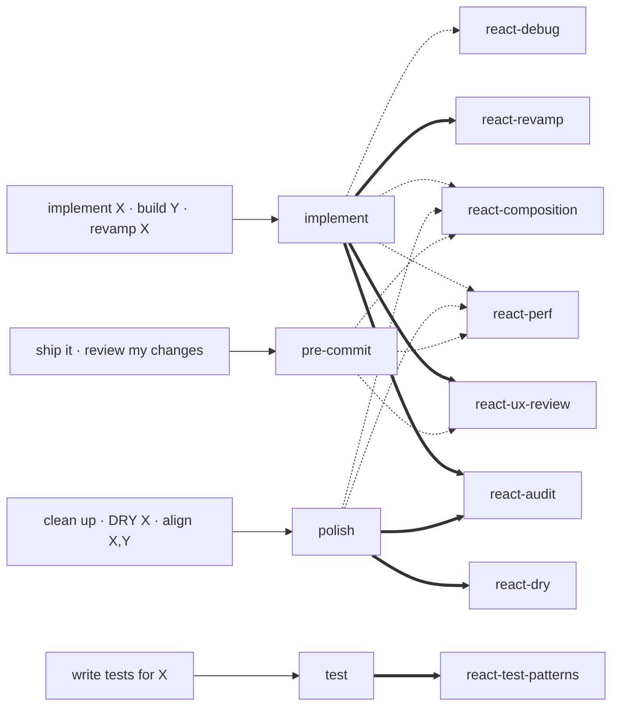

# react-agents

Templates + interactive generator for the implement / polish / pre-commit / test agent quartet used by [claude-kit](../../README.md). Pairs with [`react-core`](../react-core/) (the skills the agents invoke).

## Install

```
/plugin install react-agents@claude-kit
```

## What's in it

| Piece | Path | Purpose |
| --- | --- | --- |
| `profile-generator` skill | [`skills/profile-generator/`](./skills/profile-generator/) | Interactive scaffolder. Invoke via `/profile-generator`. |
| Agent templates | [`templates/agents/`](./templates/agents/) | `{{PLACEHOLDER}}` versions of the `implement` / `polish` / `pre-commit` / `test` agents. |
| Placeholder reference | [`docs/PLACEHOLDER-REFERENCE.md`](./docs/PLACEHOLDER-REFERENCE.md) | Every placeholder defined with example values. |
| Fork guide | [`docs/FORK-GUIDE.md`](./docs/FORK-GUIDE.md) | Manual fork instructions (if you don't want the generator). |

## Two ways to use

### A — Interactive (recommended)

```
/profile-generator
```

Claude runs a short interview (project name, paths, commands, triggers, backend settings) — most values are auto-scanned, so you only answer what can't be inferred — confirms once, then writes a complete profile to a folder you pick. Output is ready to symlink into `.claude/agents/` or `git init` + push as its own plugin.

### B — Manual fork

If you'd rather edit the templates yourself: copy `templates/agents/*.template.md` into your project, do find-replace on the placeholders documented in [`docs/PLACEHOLDER-REFERENCE.md`](./docs/PLACEHOLDER-REFERENCE.md), and place the result under your project's `.claude/agents/`. See [`docs/FORK-GUIDE.md`](./docs/FORK-GUIDE.md) for step-by-step.

## What the generated profile contains

```
<output-folder>/
├── .claude-plugin/plugin.json
├── README.md
└── agents/
    ├── <prefix>-implement.md     # builder + API debugger
    ├── <prefix>-polish.md        # cleanup + consistency
    ├── <prefix>-pre-commit.md    # pre-commit gate (English-only commit draft)
    └── <prefix>-test.md          # test writer
```

All four agents read your conventions doc (`CLAUDE.md` or whatever you name it) and walk its rules before reporting; none execute `git add` / `commit` / `push` — they draft and stop.

## Which skills each agent uses

A user phrase triggers an agent; the agent **invokes** a skill as a gate (`==>`, waits for output) or **references** it for knowledge (`-.->`, consults while working).



`==>` invoke (gate — agent picks **one** of implement's audit skills by trigger) · `-.->` reference. `dev-core` skills (`scrutinize`, `post-mortem`) are user-invoked at review / incident time — no agent calls them.

## Examples (one per agent)

Each agent **stops after proposing** — it acts only when you reply with your apply keyword.

**`implement`** — build or revamp a feature
> "implement a leave-balance widget on the profile page" → recon + plan → **STOP** → "<apply>" → chunked apply → build → report.
> For "revamp X": runs an audit + before/after mockup first (and a backend-contract check if you opt in).

**`polish`** — clean up / align existing code
> "align orders, invoices, shipments" → invokes `react-audit` → divergence matrix → **STOP** → you pick rows + "<apply>" → applies → build.

**`pre-commit`** — ship a diff
> "ship it" → bug scan · build · convention walk · **English** commit draft → **STOP** → you run `git commit`.

**`test`** — write or expand tests
> "write tests for orders" → coverage-gap audit → plan → **STOP** → "<apply>" → chunked test writing → coverage delta.

The archived [`_archive/pps-web-profile/`](../../_archive/pps-web-profile/) shows a full real (Thai-output) example.

## Working reference

The Aware `pps-web` profile is kept as a worked example under [`_archive/pps-web-profile/`](../../_archive/pps-web-profile/) — read it to see what a filled-in profile looks like. It is not published to the marketplace; generate your own with `/profile-generator`.

## License

MIT — see [../../LICENSE](../../LICENSE).
